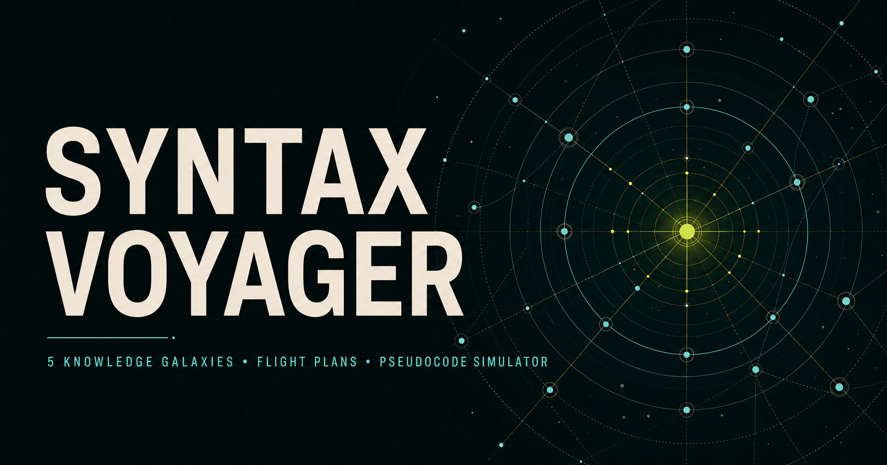

# Syntax Voyager

An accessible space-themed learning system for connected programming and
software-engineering knowledge, created with assistance from generative AI.



## What is implemented

- a cinematic, keyboard-accessible 50-node knowledge galaxy;
- five navigable knowledge sectors using the existing article graph;
- five outcome-based personal flight plans;
- device-local lesson visits, mastery signals, and resumable progress;
- four guided expedition campaigns;
- an editable pseudocode flight simulator with step traces, state, output,
  function call stacks, loop protection, and automatic mission checks;
- language bridges that translate lesson pseudocode into TypeScript, Python,
  and Java views;
- readable article routes with prerequisites, related coordinates, and an
  on-page heading navigator.

Progress stays in the current browser. The app does not require an account,
database, AI service, or remote code runner.

## Technology

- React 19 and Vinext on Vite;
- TypeScript and Markdown content;
- Three.js for the knowledge galaxy;
- Cloudflare Workers for deployment;
- Node's test runner and Playwright for verification.

## Privacy, accessibility, and AI transparency

- Learning progress is stored only in the current browser's `localStorage`.
- Core navigation and learning flows are keyboard accessible and support
  reduced-motion preferences.
- Generative AI tools assisted with the development of this project and may
  have contributed to its code, copy, and educational content.
- Published lessons and simulations are fixed application content. The running
  app does not use AI to interact with learners, generate responses, profile
  users, or make automated decisions.

### EU AI Act context

**Voluntary transparency disclosure:** This project was created with assistance
from AI-based development tools. Human review remains necessary, and the
maintainer remains responsible for the published code, documentation, and
learning content.

Repository-level controls for future AI-assisted changes are documented in the
[AI use and human review policy](docs/ai-use-policy.md).

AI assistance during development does not by itself make the resulting software
an AI system under Regulation (EU) 2024/1689. Based on the project's current
functionality, the application does not include, invoke, or expose an AI model
at runtime. Any future integration of AI functionality must be assessed
separately according to its functionality, intended purpose, provider or
deployer roles, outputs, and concrete use context.

Article 50 establishes transparency obligations for providers and deployers of
certain AI systems; it is not a universal compliance badge for repositories
developed with AI assistance. This notice is a voluntary disclosure, not a
claim of conformity, certification, legal advice, or final risk classification.
It does not replace any disclosure, technical marking, or operational obligation
that may apply to an AI system or its outputs.

Where Article 4 applies, the responsible provider or deployer must, to its best
extent, take measures to ensure an appropriate level of AI literacy among staff
and others operating or using AI systems on its behalf. A repository notice
does not satisfy those operational duties.

Legal context reviewed **31 July 2026**. The European Commission identifies
**2 August 2026** as the Regulation's general application date, subject to
staged exceptions. Check the official sources for later changes:

- [Regulation (EU) 2024/1689 — official text on EUR-Lex](https://eur-lex.europa.eu/eli/reg/2024/1689/oj/eng)
- [Article 4 — AI literacy](https://ai-act-service-desk.ec.europa.eu/en/ai-act/article-4)
- [Article 50 — transparency obligations](https://ai-act-service-desk.ec.europa.eu/en/ai-act/article-50)
- [European Commission overview and application timeline](https://digital-strategy.ec.europa.eu/en/policies/regulatory-framework-ai)

## Development

Requires Node.js `24.x`.

```bash
npm install
npm run dev
```

Useful checks:

```bash
npm run build
npm run lint
npm test
npm run test:e2e
```

Every push runs lint, unit/render tests, and the Chromium end-to-end suite in
GitHub Actions.

On Windows, if Node reports `EPERM` while resolving the OneDrive root, run the
same check through the included mapped-drive helper:

```powershell
.\scripts\run-node-safe.ps1 -NpmScript test
```

`npm run content:build` validates every Markdown article and regenerates the
application content bundle.

## Project shape

- `content/` — articles and the pseudocode/content contracts;
- `scripts/generate-content.mjs` — content and graph validation;
- `app/` — the galaxy, articles, Mission Control, and Simulation Deck;
- `lib/voyage.ts` — galaxies, flight plans, expeditions, and lab missions;
- `lib/pseudocode.ts` — the bounded educational pseudocode runtime;
- `lib/language-bridge.ts` — lesson example translations;
- `tests/` — rendered-route and learning-engine verification.

The app keeps one source of truth for article content and graph relationships.
Learning routes and sectors reuse those coordinates instead of introducing a
second content model.

## Contributions

This repository does not accept external contributions or pull requests.

Project background lives in the [project plan](docs/project-plan.md) and the
[beginner usability study](docs/usability-study.md).

## Security

Please follow [SECURITY.md](SECURITY.md) and do not disclose vulnerability
details in a public issue.

## License

No open-source license has been selected yet. Until a `LICENSE` file is added,
all rights are reserved by the copyright holder.
