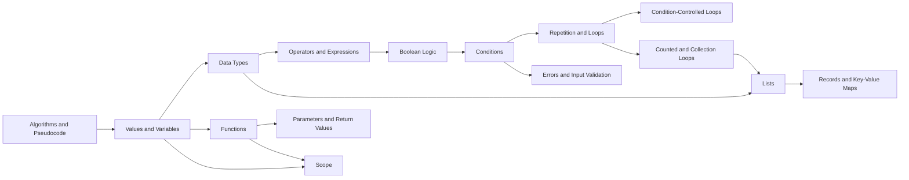

# Syntax Voyager project plan

> Navigate connected software knowledge.

## 1. Vision

Syntax Voyager is an international knowledge blog about software development.
Every article is also a node in a connected knowledge graph and a place in an
optional 3D universe.

Visitors can:

- read articles normally;
- explore related concepts visually;
- use Warp Search to jump directly to a topic;
- follow guided learning expeditions.

AEVO is not the main subject. It shapes how the knowledge is explained:
clearly, practically, and with useful learning goals, examples, exercises, and
feedback.

## 2. Audience

The initial audience is:

- apprentices training as software developers;
- self-taught beginners;
- junior developers filling knowledge gaps;
- experienced developers looking for practical explanations.

The first version is written in English. German content can be added later when
there is evidence that maintaining both languages is worthwhile.

## 3. Product principles

1. **Readable first:** Every node is a normal, fast, shareable web article.
2. **Connections have meaning:** Graph edges represent real relationships, not decoration.
3. **3D is optional:** The universe enhances navigation but never blocks reading.
4. **Practice beats trivia:** Examples, mistakes, and small exercises accompany explanations.
5. **One source of content:** Articles and graph metadata live together.
6. **Show uncertainty:** Sources and the last review date are visible.

## 4. Core experience

The main loop is:

1. Search for a question or discover a nearby concept.
2. Warp to the matching node.
3. Read the explanation and example.
4. Complete one small challenge.
5. Continue to a prerequisite, related concept, or next expedition step.

Warp Search starts as a normal keyword search. Semantic or AI-powered search is
only added if the content library becomes too large for keyword search.

## 5. Information model

Each article contains:

- title and short summary;
- difficulty level;
- learning goal;
- prerequisites;
- explanation;
- practical example;
- common mistake;
- small exercise;
- related nodes;
- sources and last-reviewed date.

Graph relationships use a small fixed vocabulary:

- `requires`
- `builds-on`
- `used-with`
- `part-of`
- `contrasts-with`
- `example-of`

The same metadata powers article links, search context, learning paths, and the
3D universe.

All introductory code examples use one documented pseudocode notation instead
of a real programming language. The notation uses a small set of readable
keywords:

```text
SET score TO 0

IF score IS AT LEAST 10 THEN
    DISPLAY "Level complete"
ELSE
    DISPLAY "Keep going"
END IF

FOR EACH item IN items
    DISPLAY item
END FOR

FUNCTION add(left, right)
    RETURN left + right
END FUNCTION
```

Examples avoid language-specific syntax, frameworks, type systems, and standard
libraries. Later systems can show how the same concept looks in real languages.

## 6. First knowledge system: Programming Fundamentals

The first system teaches the concepts needed to understand and describe simple
programs without committing to a programming language.

### Nodes

1. **Algorithms and Pseudocode**  
   Turning a problem into a finite sequence of understandable steps.

2. **Values and Variables**  
   Storing, naming, reading, and changing information.

3. **Data Types**  
   Numbers, text, booleans, and the meaning of a value.

4. **Operators and Expressions**  
   Calculating, comparing, and combining values.

5. **Boolean Logic**  
   Building true-or-false expressions with AND, OR, and NOT.

6. **Conditions**  
   Selecting which instructions should run.

7. **Repetition and Loops**  
   Understanding repeated execution and termination.

8. **Condition-Controlled Loops**  
   Repeating while a condition remains true.

9. **Counted and Collection Loops**  
   Repeating a known number of times or once per item.

10. **Functions**  
    Naming and reusing a piece of behavior.

11. **Parameters and Return Values**  
    Passing information into and out of functions.

12. **Scope**  
    Understanding where variables exist and can be accessed.

13. **Errors and Input Validation**  
    Detecting invalid input and returning useful errors.

14. **Lists**  
    Keeping an ordered collection of values.

15. **Records and Key-Value Maps**  
    Grouping named values and looking them up by key.

### Graph



## 7. First expedition

### Mission: Build a Number Guessing Game

The visitor assembles a small program entirely in pseudocode:

1. Store a randomly selected target number in a variable.
2. Read and validate the player's input.
3. Compare the guess with the target using conditions.
4. Repeat until the correct number is found.
5. Move the comparison into a function.
6. Store previous guesses in a list.
7. Return a useful error for invalid input.
8. Display a final record containing attempts and result.

At each step, the visitor predicts the next state or completes a small
pseudocode fragment. The final view shows how the concepts combine into one
program.

## 8. MVP

The first publishable version contains:

- the 15 articles above;
- normal article pages;
- keyword search;
- prerequisite and related-node links;
- one small 3D star map using the same graph data;
- Warp transition with a reduced-motion option;
- the first expedition;
- visited-node progress stored locally in the browser;
- a complete list view for mobile devices and accessibility.

Not included initially:

- user accounts;
- multiplayer;
- comments or community publishing;
- AI tutor or generated answers;
- complex rewards, levels, or virtual currency;
- a custom content management system;
- automatic multilingual content.

## 9. Delivery plan

### Phase 1: Content foundation

- Define the shared article format.
- Write and structurally validate representative articles.
- Confirm the prerequisite chain and graph relationships.
- Review the explanations with at least one beginner before publication.

### Phase 2: Readable blog

- Build the home page, article view, search, and related links.
- Publish all 15 articles.
- Add sources, review dates, and basic accessibility.

### Phase 3: Universe

- Render the same 15 nodes as a navigable 3D system.
- Add selection, focus, Warp Search, and reduced motion.
- Keep article URLs and list navigation available everywhere.

### Phase 4: Expedition and validation

- Add the number-guessing expedition and local progress.
- Test with five target users.
- Fix navigation and comprehension problems before adding more systems.

## 10. Success criteria

The first system succeeds when target users can:

- find a requested topic within 30 seconds;
- trace how variable values change while pseudocode runs;
- choose a condition, loop, function, or data structure for a simple problem;
- write a small language-agnostic algorithm in pseudocode;
- identify what they should learn before a selected topic;
- use the 3D view without losing their location;
- complete the expedition without external instructions.

## 11. Current implementation

The application now includes:

- 50 validated articles rendered at stable URLs;
- keyword search and a cinematic, keyboard-accessible knowledge galaxy;
- five knowledge sectors derived from the same article graph;
- five personal flight plans with device-local visits and mastery;
- four guided expedition campaigns;
- an interactive pseudocode simulator with stepping, state, output, function
  call stacks, loop protection, and automatic checks;
- TypeScript, Python, and Java translation views for lesson pseudocode;
- prerequisites, related coordinates, previous/next navigation, and an
  on-page heading navigator.

The implementation still preserves one content model. Galaxies, routes,
expeditions, search, and article navigation reference the validated article IDs
instead of duplicating article content.

Progress is intentionally device-local. The current learning loop does not
require a CMS, database, account system, AI tutor, or remote code-execution
service.
